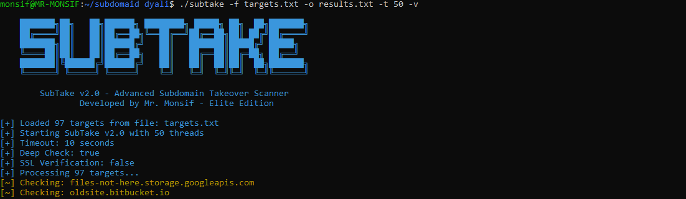

# SubTake v9.10 Subdomain Takeover Scanner

#### Developed by [Mr. Monsif](https://github.com/mrmonsif) | Elite Edition

---

## 🚀 **Overview**

**SubTake** is a modern, advanced, and open-source subdomain takeover scanner written in Go, developed from scratch by **Mr. Monsif**.  
The tool is designed for maximum speed, precision, and flexibility, suitable for bug bounty hunters, security researchers, and anyone who needs reliable subdomain takeover reports.  
It offers detailed output, supports massive wordlists, and rivals (or surpasses) many of the world's top open-source alternatives.

---

## 🌟 **Key Features**

* **High-speed, multi-threaded scanning** (you choose the number of threads)
* **35+ major cloud & SaaS takeover fingerprints** (GitHub Pages, Heroku, S3, Netlify, Azure, and more)
* **Deep HTTP/Body/Header analysis with accurate fingerprint matching**
* **Realistic output:** vulnerable / potential / safe, with confidence level for each result
* **Colorful terminal UI and support for CSV/JSON export**
* **Customizable scan options (deep check, SSL verification, etc)**
* **Supports scanning a single target or huge target lists**
* **Clean, well-structured code – easy to extend or modify**

---

## ⚡ **Requirements**

* **Go 1.19+** (tested on Go 1.19, 1.20, 1.21)
* **Stable Internet connection**
* **Supported OS:** Linux, WSL, Windows, or macOS

---

## 🛠️ **Installation**

1. **Check that Go is installed:**

   ```bash
   go version
````

If not, install Go:

```bash
sudo apt update && sudo apt install golang-go -y
```

2. **Clone this repo or copy the files:**

   ```bash
   git clone https://github.com/USERNAME/SubTake.git
   cd SubTake
   ```

3. **Auto-install (recommended):**

   ```bash
   chmod +x install.sh
   ./install.sh
   ```

   Or build manually:

   ```bash
   go mod tidy
   go build -o subtake subtake.go
   ```

---

## 📦 **Project Structure**

* `subtake.go` – main tool source code
* `install.sh` – automated build/install script
* `go.mod` / `go.sum` – Go modules/dependencies
* `config.json` – (optional) example config file
* `targets.txt` – example targets wordlist

---

## 🔥 **Usage**

### **Scan a list of subdomains:**

```bash
./subtake -f targets.txt -o results.txt -t 50 -v
```

* `-f` : input file with subdomains (one per line)
* `-o` : output file (CSV or JSON)
* `-t` : number of threads (default: 50)
* `-v` : verbose output

---

### **Scan a single subdomain:**

```bash
./subtake -d sub.example.com
```

---

### **Export results as JSON:**

```bash
./subtake -f targets.txt -json -o results.json
```

---

### **Additional options:**

* `-ssl` : enable SSL verification (default: false)
* `-deep` : enable deep check (analyze response body/header for every service)

---

## 🖥️ **Sample Output**

Colorful, detailed output in terminal:

```
[VULNERABLE] abandonedrepo.github.io -> abandonedrepo.github.io. (GitHub Pages) [high] Status: 404 | Body match
[VULNERABLE] deadapp.herokuapp.com -> va04.ingress.herokuapp.com. (Heroku) [high] Status: 404 | Body match
[+] Scan completed!
[+] Vulnerable: 16
[+] Safe: 81
[+] Results saved to: results.txt
```

<p align="center">
  
</p>

<p align="center">
  
</p>

---

## 👑 **Author**

> Developed by **Mr. Monsif**
> Contact: [github.com/mrmonsif](https://github.com/mrmonsif)

---

## ⚠️ **Legal Notice**

This tool is for educational and authorized security testing only.
**Do not scan or test targets without explicit permission.**
Use at your own risk.

---

## 🌐 **Support & Contributions**

If you find a bug, want to suggest a new feature, or contribute:

* Open an issue or pull request on GitHub
* Or contact the developer directly

---

**Ready for copy-paste into your GitHub!
If you want to add your email or a sponsor/donation badge, let me know and I'll add it instantly.**
